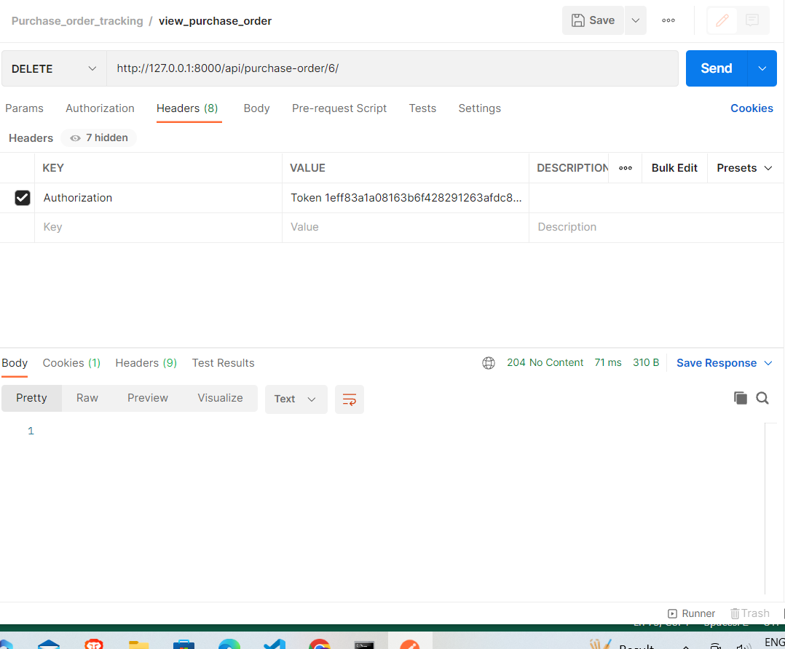

# Vendor Management Made Easy

##Streamline your vendor management with this Django and Django REST Framework based system! It empowers you to:
- Create and manage vendor profiles
- Track purchase orders efficiently
- Gain insights into vendor performance

## Prerequisites

- Python (update version)
- Django (version 4.2.7)
- Django REST framework (3.14.0)

## Installation

# 1. Clone the repository:
   bash:  
   git clone https://github.com/WaghmareDeepali/Vendor_management_system.git  
   cd VMS  

# 2.Create a virtual environment:
python -m venv env  
source env/bin/activate  # For Linux/Mac  
env\Scripts\activate     # For Windows  

# 3.Install dependencies:
pip install -r requirements.txt  

# 4.Database setup:
python manage.py makemigrations  
python manage.py migrate  

##Runserver
# 1.Start the server:
python manage.py runserver 
- http://127.0.0.1:8000/ 

# 2.Access API endpoints:

## Vendor API: /vendor/
Purchase Order API: /purchase-order/  
Historical Performance API: /vendor/historical_performance  

# Access Token  
1. '/gettoken/' #provide username and password in json eg. { "username":"deep","password":"deepali@123" }  
   I used Postman to test API  
# once Token is created or received provide it to 
2. HEADER  
- with key as Authorization (eg. key : Authorization) and value as token <received-token>    

## API Endpoints
Vendor API  
● POST /api/vendor/:    Create a new vendor.  
● GET /api/vendor/:    List all vendors.  
● GET /api/vendor/{vendor_id}/: Retrieve a specific vendor's details.  
● PUT /api/vendor/{vendor_id}/: Update a vendor's details.  
● DELETE /api/vendor/{vendor_id}/: Delete a vendor  
for eample:

 #Vendor Performance Endpoint (GET /api/vendor/{vendor_id}/performance)  
  
Purchase Order API  
● POST /api/purchase-orders/: Create a purchase order.  
● GET /api/purchase-orders/: List all purchase orders with an option to filter by vendor.  
● GET /api/purchase-orders/{po_id}/: Retrieve details of a specific purchase order.  
● PUT /api/purchase-orders/{po_id}/: Update a purchase order.  
● DELETE /api/purchase-orders/{po_id}/: Delete a purchase order 
 

Vendor Performance Evaluation  
● GET /api/vendors/{vendor_id}/performance: Retrieve a vendor's performance metrics  

Historical Performance API  
GET /vendor/historical_performance: List historical performance for all vendors.
  
GET /vendor/historical_performance/{id}/: Retrieve historical performance for a specific vendor.  

Update Acknowledgment Endpoint:  
● While not explicitly detailed in the previous sections, consider an endpoint like  
POST /api/purchase-orders/{po_id}/acknowledge for vendors to acknowledge POs.  
● This endpoint will update acknowledgment_date and trigger the recalculationof average_response_time  

